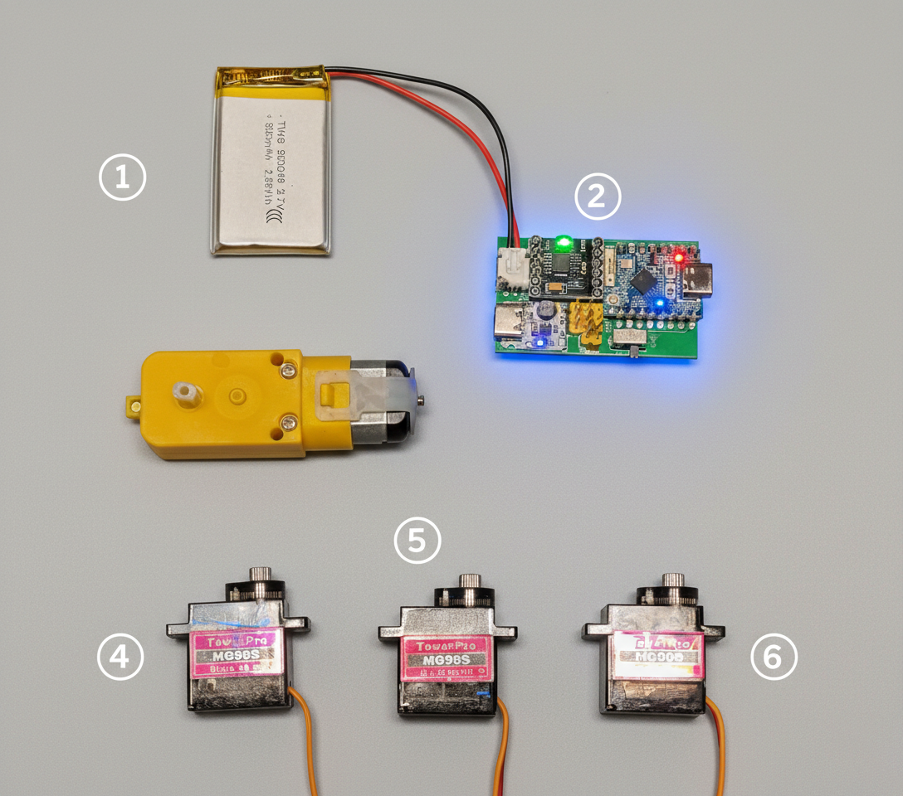
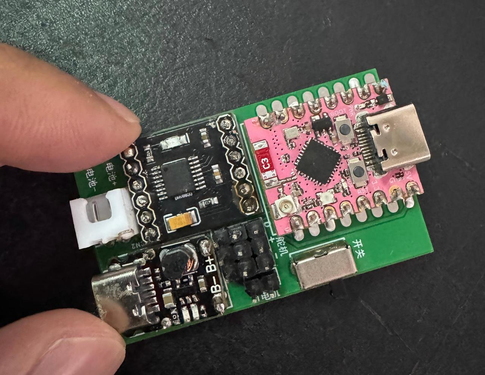

# ESP32-C3 Mini Robo Arm Control Module

[中文版](README.md)

This project is a compact robotic arm firmware based on ESP32-C3.  
It provides a Web control panel and real-time WebSocket control, with multi-WiFi memory, auto provisioning, and heartbeat status feedback.

Online serial terminal (for viewing serial logs):
https://googlechromelabs.github.io/serial-terminal/

## Project Images





## Key Features
- Web control panel (LittleFS static pages)
- Real-time WebSocket control with heartbeat status
- Multi-WiFi memory and auto reconnect
- Auto AP provisioning mode when WiFi is unavailable
- Control for 2x 360-degree servos, 1x 180-degree servo, and 1x TT motor

## Hardware Pins
- `SERVO1_PIN`: GPIO2 (360-degree servo 1)
- `SERVO2_PIN`: GPIO3 (360-degree servo 2)
- `SERVO3_PIN`: GPIO4 (180-degree servo)
- `MOTOR_IN1`: GPIO0 (TT motor)
- `MOTOR_IN2`: GPIO1 (TT motor)
- `LED_PIN`: GPIO8 (status LED)

## Project Structure
- `src/main.cpp`: Main firmware
- `data/index.html`: Web control page
- `data/style.css`: Page styles
- `data/script.js`: Frontend logic and WebSocket protocol
- `platformio.ini`: Build and dependency configuration

## Dependencies
Configured in `platformio.ini`:
- WiFiManager
- ESP32Servo
- WebSockets
- ESPAsyncWebServer + AsyncTCP
- ArduinoJson

## Quick Start
1) Open the project in PlatformIO  
2) Build and upload firmware
```bash
pio run -t upload
```
3) Upload LittleFS static assets
```bash
pio run -t uploadfs
```
4) Serial baud rate: `115200`

## WiFi Provisioning and Reset
- The device first tries saved WiFi networks
- If connection fails, it starts AP provisioning mode automatically
  - SSID: `ESP32-RobotArm-<MAC>`
  - Open the portal in a browser to configure WiFi
- Reset WiFi settings:
  - Visit `http://<device-ip>/reset-wifi`

## Web Control Interface
Open in browser:
```
http://<device-ip>/
```
WebSocket endpoint:
```
ws://<device-ip>:81
```

## WebSocket Protocol
Client messages:
```json
{"type":"run_duration","motor":"servo1","speed":130,"duration":100}
{"type":"start_continuous","motor":"servo2","speed":130}
{"type":"stop","motor":"motor"}
{"type":"servo180","angle":90}
```
Server heartbeat:
```json
{"type":"heartbeat","timestamp":12345,"rssi":-60,"uptime":12,"ssid":"MyWiFi"}
```

## HTTP API
- `GET /wifi-info`: Get WiFi status and saved SSID list
- `GET /reset-wifi`: Clear WiFi config and reboot

## Open Source Resources
The full project is open source and ready to replicate.

1) 3D Printed Structural Parts  
MakerWorld model by Leng入瑶:  
https://makerworld.com.cn/zh/models/1760642  
Important: choose the version for third-party servos + TT motor.

2) PCB Control Board  
Open-source hardware page (OSHWHub):
https://oshwhub.com/tonytang2/esp32-armbot

3) Full BOM + Tutorial + Firmware  
Complete guide:
https://gizfolo.com/p/robot-arm

## Notes
This is an open-source DIY robotic arm control module.  
Feel free to build, modify, and share.
